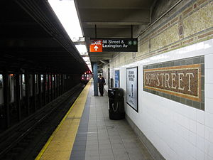

# TrainScheduler

 
  This app was to implement 2 new main new technologies firebase for persistent data storage, and Moment.js for Date and time events. This website will provide up-to-date information about various trains, namely their arrival times and how many minutes remain until they arrive at their station.

